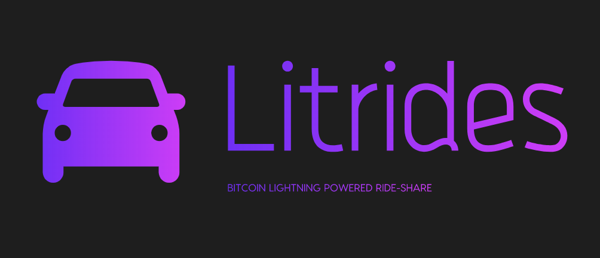

## `Hack Mobility 2019`
    * TRACK 2 | Equitable | Sponsor: eBay Motors
```
How can we make transportation more accessible to everyone in society? 
From ride-sharing to better cheaper transit options, we can’t wait to see what you build.
```

## `Project: Litrides`
Bitcoin Lightning powered ride-share: [https://litrides.herokuapp.com/vehicle](https://litrides.herokuapp.com/vehicle)

## `Rationale`
```
Unless you have a credit card, you will not be able to participate in the current global ride-share revolution. The Bitcoin Lightning Network offers a fast and cheap way for anybody with a mobile device, to transact and participate in the global economy.
Litrides is a proof of concept to show that the Lightning Network invoicing system is a great for API services like Smartcar API.
```

## `User Journey`
```
My name is Demba. I'm West Africa and here we have a hard time getting access to credit cards. It's been really difficult and expensive trying to find rides to Job Interviews. 
I recently came across and ad about being able to rent a card from an invidual without the need for a credit card. They use Bitcoin whcih is an international currency. I signed up for an account, and now I can make it to any job interview on time. The future is looking bright!
```
```
My name is Alice and I'm a self employed Software Developer. Unfortunaltely, projects have been slow to come as of late and I need to make some extra money to cover my bills.

I recently heard about this service called Litrides, where I can rent my car to other invidual and earn a healty amount of crypto currencies. 

I visited Litrides, signed for an account and made my vehicle available  for short term rent.
```
```
My name is Bob and I have bad credit. For that reason it's been impossible for me to get an account at Turo or GetAround. 
Luckily, someone in my social media circle recommended Litrides to me. I don't need a credit card to participate. A little bit of Bitcoin will suffice.
```

## Technology
* [X] [Smartcar API](https://smartcar.com/product/lock-unlock/)
* [X] [Bitcoin Lightning](https://lightning.network/)
* [X] [Lightning Network White Paper](https://lightning.network/lightning-network-paper.pdf)
* [X] [BTCPay Server](https://btcpayserver.org/)
* [X] [NodeJS](https://nodejs.org/en/)
* [X] [Heroku](heroku.com)
* [X] [Blue Wallet](https://bluewallet.io/)


© Copyright 2019 Fodé Diop